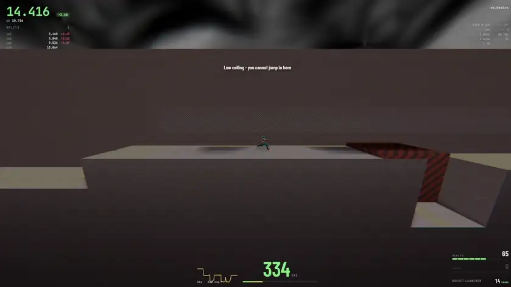

# Overbounce

A browser-based 3D sidescrolling speedrunning game built on a bug-for-bug faithful port of
Quake III Arena movement. No enemies, no combat — just obstacle courses and the movement
techniques Q3 players have been refining since 1999: strafe jumping, circle jumps, rocket
jumps, plasma climbing, and the mechanic the game is named after.

The physics are not "inspired by" Quake 3. They are a line-by-line port of `bg_pmove.c`,
`bg_slidemove.c` and `cm_trace.c`, including the bugs — because in a movement game the bugs
*are* the mechanics.

This project is pure slop; no code was written by a meatbag.

**[▶ Play now](https://joa.github.io/overbounce/)** — runs in the browser, nothing to
install, nothing to sign into. Two tutorial courses are built into the page; you can drop
in your own Quake III or OpenArena maps from the course list.

## The movement

Three things fell out of the port rather than being tuned in, which is the best evidence
available that it is right.

**Overbounce works, and it is rare.** Land in the eighth of a unit where Quake skips its
collision clipping and you keep the whole of your falling speed. It has two faces, and
they are the same four lines of code:

- **Run into one** and the fall redirects sideways. A 312-unit drop at 100ups comes out
  at **658ups**.
- **Drop onto one** and it fires you straight back up at the speed you landed —
  **−390ups in, +390ups out**, returning you to the height you fell from. This is the one
  Q3 players mean by "an OB", and it is what gets you to places you otherwise cannot
  reach.

Because the window is an eighth of a unit wide, real overbounce spots are specific
coordinates on specific maps. The HUD tells you when you are on one, and how you would
have to arrive.

**Strafe jumping beats the speed cap.** Quake only measures your speed along the direction
you are *asking* to move, so holding an offset angle keeps the 320ups cap permanently out
of reach. Good play climbs past **1200ups** in ten seconds. The HUD draws the window you
are aiming for and where inside it you actually are.

**125fps jumps higher than 1000fps.** Velocity is snapped to whole units every frame, so
the tick rate decides how much gravity gets rounded away: 48.6 units of jump height at
125, 36.5 at 1000. Q3 players settled on `com_maxfps 125` by feel two decades ago, and
reproducing that ordering from the constants alone is what pinned down the last unknown in
the port.

## Courses

Two tutorial courses ship with the game and need nothing else installed: **ob_basics** for
movement and **ob_rockets** for rocket and grenade jumps.

Everything past that is your own. Quake III and OpenArena maps work as courses because the
entity layer is a port too, not an approximation — triggers, jump pads, teleporters, doors
and buttons behave the way the map author expected. Drop a `.pk3` onto the course list and
it appears alongside the built-in ones; your files always take precedence over the bundled
kit. Timing follows the defrag convention, so maps built for defrag time themselves
correctly.

A jump pad is the nicest example of why porting beats approximating. Quake does not launch
you at a speed in a direction — it solves for how long a body takes to *fall* from the
target's height and gives you exactly the velocity that arrives there. Which is why a
Quake jump pad lands you *on* its target rather than near it.

## Runs, records and ghosts

Every course you finish is timed and kept. The run screen afterwards shows your splits
against your personal best segment by segment, the sum of your best segments, your top and
average speed, how much of the run you spent airborne, how much of the available strafe
gain you actually took, and the whole run drawn as one speed-and-height trace with your
shots and jumps marked on it. A second tab tracks the course over time.

**Ghosts are real opponents, not animations.** A ghost is a recording of the inputs you
pressed, replayed through the same physics — so it goes exactly where you went, and races
you frame for frame. Export one and send it to someone.

Records are kept per course *and* per mode: the same map played in VQ3 and CPM, or from
the side camera and first person, holds separate personal bests, because they are
different runs. The results screen badges which one you just did.

Anything that makes it easier means no clock. Pausing costs the attempt, dying costs the
attempt, and turning off self-damage turns off the timer with it.

## Playing it your way

**Physics and camera belong to the course.** Every course declares what it was built for —
VQ3 or CPM, and side-on, chase or first person — and you can override either from the
course list. The override is remembered for that map, not globally.

**Two looks, one switch.** Modern gives you AgX tone mapping, ambient occlusion, real
shadow maps, refractive water and lava that blooms and shimmers. Faithful 1999 turns all of
it off and draws what Quake actually drew. Or set each effect yourself. Nothing in that
panel can move an overbounce spot — the physics cannot see the renderer at all, and the
code is structured so it never can.

Also in settings: what the HUD is allowed to tell you, two rebindable binds per action,
volume, and your name and player model. **Photo mode** pauses the game and gives you a free
camera, depth of field and a screenshot.

## Controls

All of these are rebindable in Settings, and every action keeps two binds.

| | |
| --- | --- |
| **WASD** | move |
| **mouse** | turn &middot; **left** fire &middot; **right** jump |
| **space** | jump |
| **ctrl** | crouch |
| **1 / 2 / 3** | rocket launcher, grenade launcher, plasma gun |
| **wheel** | cycle the weapons you are carrying |
| **X** | kill yourself, which restarts the run |
| **Esc** | pause &middot; **R** restart &middot; **F3** debug panel |

Right-click jumps because rocket jumping wants fire and jump on the same hand and within a
frame of each other, and reaching for space to do it is the most awkward thing about the
default binding.

Slot **4 is reserved for the rail gun**, which is not implemented yet — some maps will need
it to shoot a target.

## VQ3 and CPM

VQ3 is the default, and it is the mode with the fidelity guarantee: a line-by-line port of
id's own source, bugs included.

CPM is not a verified port and cannot be one, because CPMA's game code is closed source.
What it does have is evidence — every CPM constant here was read out of CPMA 1.53's own
shipped game image rather than taken from community prose, and where the two disagreed the
image decided. Air control, ramp jumps and the 400ms double-jump window are all in.

## More

- **[Every URL parameter](docs/url-parameters.md)** — the diagnostic switches behind the
  settings screens, for bug reports and for looking at something specific.
- **[Developing Overbounce](docs/development.md)** — building it, testing it, and how the
  port is put together.

## Licence

GPLv2-or-later. The movement and collision code is a derivative work of id Software's
GPLv2 Quake III Arena source, so the project inherits that licence. See `LICENSE` and
`NOTICE`.

Assets come from [OpenArena](https://github.com/OpenArena). Assets from a commercial
Quake III Arena installation are **not** redistributable and must never be committed here.

Overbounce is not affiliated with or endorsed by id Software or Bethesda Softworks.

The load-bearing counter: 47
