# Overbounce

A sidescrolling speedrun game with Quake III Arena movement, in your browser.

No enemies. No shooting at anything that shoots back. Just you, a course, and a clock.
The weapons are there to move you: rockets to launch off, plasma to climb with, grenades to
ride. Everything Q3 players have been drilling since 1999 works here, because the movement
code is a line-by-line port of Quake III's, bugs included.

This project is pure slop. It is entirely AI generated, and no meatbag has touched any of the
code.

The load-bearing counter: 71

### **[▶ Play now](https://joa.github.io/overbounce/)**

Nothing to install, nothing to sign into. Ten courses are built in. Bring your own Quake III
or OpenArena maps if you want more.

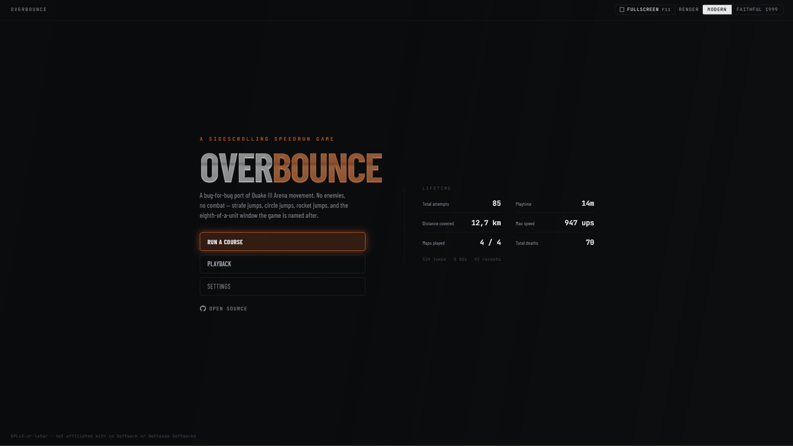

Everything you have ever done is on that screen: attempts, distance, top speed, deaths.

---

## It looks like this

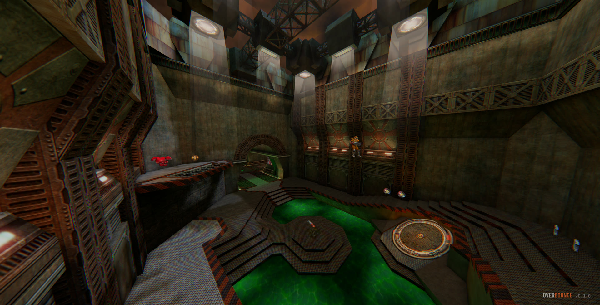

Light shafts, coloured liquid, real shadows. Quake's maps with a modern renderer on top.

| | |
| --- | --- |
| 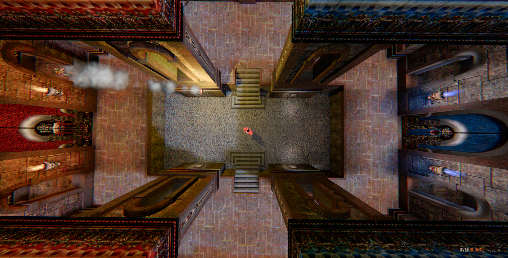 | 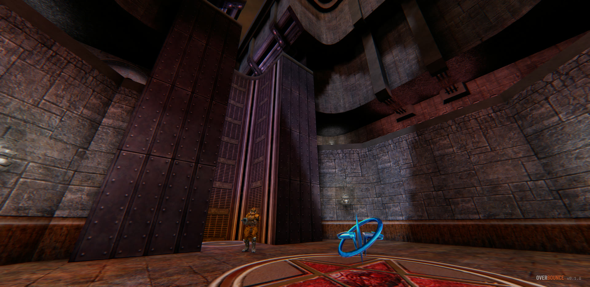 |
| 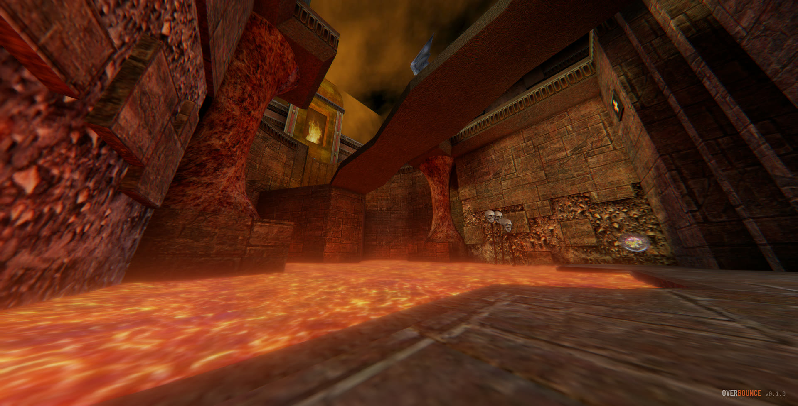 | 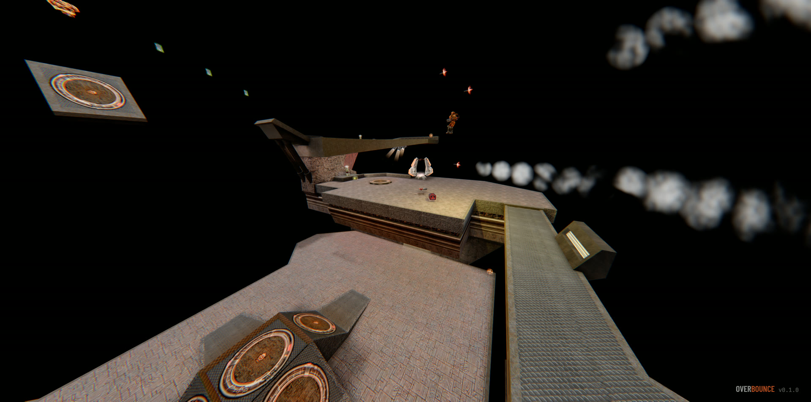 |
| 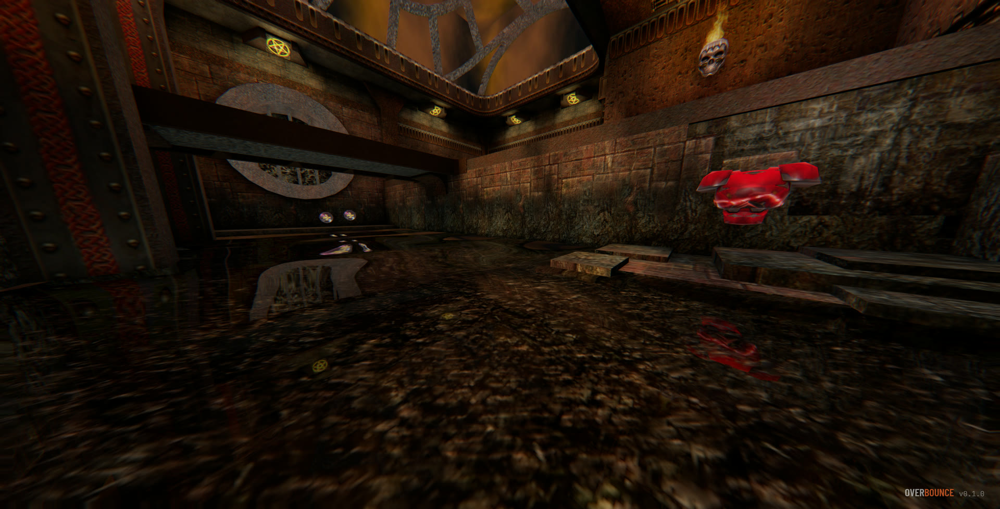 | 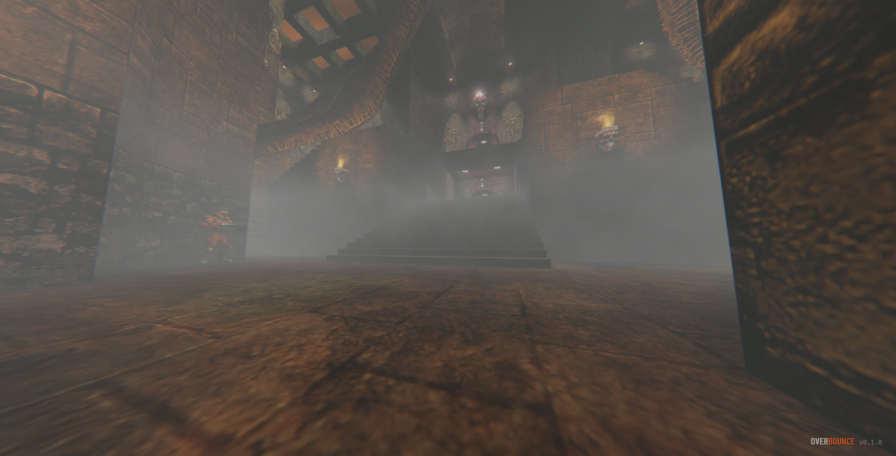 |

WebGPU, with AgX tone mapping, ambient occlusion, shadow maps, volumetric fog, lava that blooms
and shimmers, and motion blur.

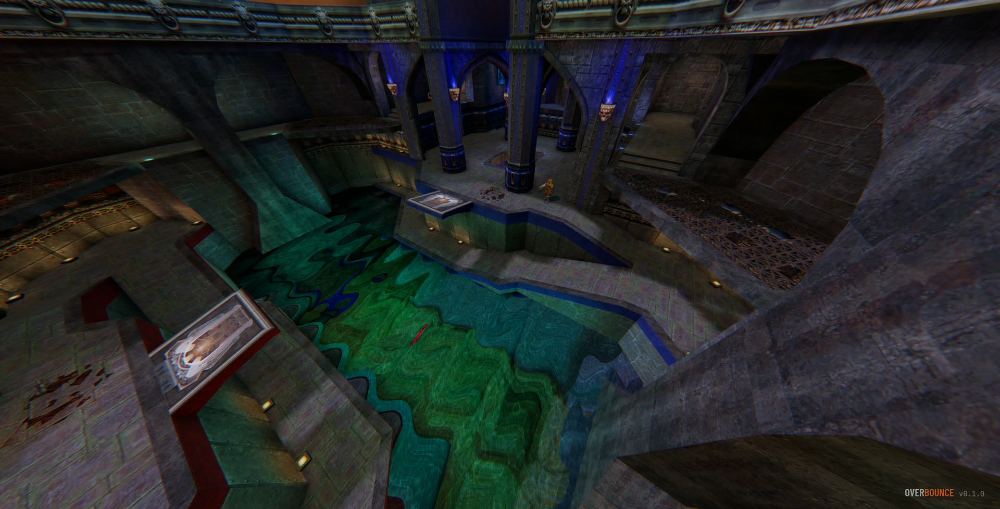

Water you can see into, and see reflected off.

Prefer it the old way? **Faithful 1999** is one click and turns every bit of that off, down to
Quake's own blob shadow. Or set each effect yourself. None of it can change how the game plays:
the physics cannot see the renderer.

## Playing

**Three cameras, and the side one is the point.**

- **Side** is what the game is built around. The world is fully 3D, you just watch it from
  the side, so you can see the gap you are about to clear and the pad you are about to
  overshoot. Some courses lock the camera to a rail and follow a script the mapper wrote.
- **Chase** sits behind you.
- **First person** draws the gun in your hands, with Quake's own walk bob and landing dip.

Pick per course. Your choice is remembered for that map.

**Three things to learn.**

*Strafe jumping.* Hold a strafe key, turn that way, and keep jumping. Quake only measures your
speed along the direction you are asking to go, so the 320ups cap never catches you. Good runs
pass 1200ups inside ten seconds.

*Rocket jumping.* Fire down and jump at the same moment. Firing alone is not enough.

*The overbounce.* Land in the eighth of a unit where Quake skips its collision clipping and you
keep all of your falling speed. Arrive with speed and it flings you sideways. Arrive with none
and it fires you straight back up as fast as you came down, which is how you reach places you
otherwise cannot. The spots are exact coordinates on exact maps, so the HUD tells you when one
is under you and how you would have to hit it.

## Courses

Seven are built for the game: **ob_basics** teaches movement, **ob_rockets** is rocket and
grenade jumps, **ob_crypt** runs over lava through jump pads and a vertical overbounce down an
iron shaft, **ob_yard** is floating slabs in a starfield where some pads only reach the next
platform if you strafe mid-flight, **ob_grounds** is a gothic courtyard of ground strafe
jumps with no ceiling in the way, a fog garden, and a last gap you make by turning a fall into speed,
**ob_strafes** is a temple over the void: eight ever-wider strafe jumps between floating islands,
a gap only a quad rocket jump crosses, and two quad rockets out of a deep pit, and
**ob_circuit** is a descending sci-fi circuit of three crossings, each with a high, a middle and a
low line to choose from (jump pads, strafe jumps, rocket jumps, overbounces and a slick slide), so
there are 27 ways through it.

Three real DeFRaG maps ship too: **de4th_run1**, **de4th_run2** and **acc_fuzzle**.

Past that, bring your own. Drop a `.pk3` on the course list and it shows up next to the built-in
ones. Quake III and OpenArena maps work properly, not approximately: triggers, jump pads,
teleporters, doors and buttons all behave the way the mapper intended. Maps built for DeFRaG
time themselves correctly.

**CTF maps time themselves too.** A `ctf` map has no start gate, so the flags are the gates:
grab either flag, reach the other team's, and that is your run. Both directions count and share
one record. These show up as **CTF** on the course list rather than FREERUN — q3ctf1 and q3ctf2
are two of the best maps in the game and now there is something to beat on them.

## Getting the real Quake III

You do not need it. What ships here is [OpenArena](https://openarena.ws/), which is free, and
the game is complete with it.

You need it for **q3dm6, q3dm17, q3ctf1** and the rest — the maps in the screenshots above, with
the textures and the sounds id shipped. Those files are not free and are not in this repository,
and never will be. You buy the game, you point Overbounce at `pak0.pk3` from your own `baseq3`
folder, and it loads.

- **[Steam](https://store.steampowered.com/app/2200/Quake_III_Arena/)** — the usual place.
  It will probably not sell it to you in the EU: Quake III Arena is on the German index, and
  the store honours that across the region.
- **[k4g](https://k4g.com/product/quake-iii-arena-steam-global-instant-cd-key-cd-key-8D2F9B86)**
  — a global Steam key, which is how EU players get around the above. It activates the same
  Steam copy.
- **[GOG](https://www.gog.com/en/game/quake_iii_arena)** — usually the cheapest, and the only
  one on this list that is *not* a Steam key: you get a plain installer, so the paks are yours
  as files without Steam in the middle. Often the least painful route to `pak0.pk3`.
- **[Fanatical](https://www.fanatical.com/en/game/quake-iii-arena)**,
  **[Green Man Gaming](https://www.greenmangaming.com/games/quake-iii-arena-pc/)**,
  **[Humble](https://www.humblebundle.com/store/quake-iii-arena)** — all Steam keys, and worth
  a look when one of them is discounting.
- **An old disc.** The 1999 CD works, and so does the Quake III *Gold* / *Team Arena* box. Any
  `baseq3/pak0.pk3` is the file.

Overbounce reads the pak in your browser. Nothing is uploaded, and nothing leaves your machine.

## Records and ghosts

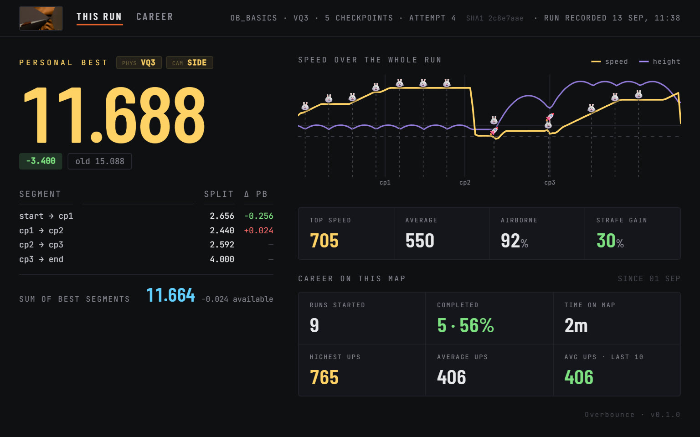

Every finish is timed and kept. Afterwards you get your splits against your best, segment by
segment, your top and average speed, how long you spent in the air, how much of the available
strafe gain you actually took, and the whole run drawn as one speed trace with your jumps and
shots marked on it.

**Ghosts race you properly.** A ghost is a recording of the keys you pressed, replayed through
the same physics, so it goes exactly where you went. Export one to send to a friend: a run of
about fifteen seconds packs down small enough to paste straight into a Discord message, and
longer ones save as a file.

Records are kept per course *and* per mode. The same map in VQ3 and in CPM, or from the side
camera and first person, keeps separate personal bests.

Anything that makes it easier stops the clock: pausing, dying, or turning off self-damage.

## Playback

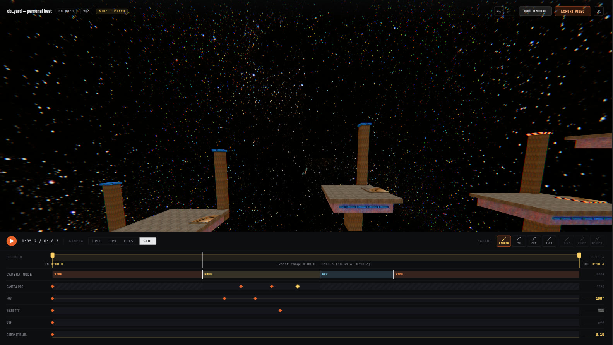

Watch your own runs back, or watch **Quake III `.dm_68` demo files**. Drop a demo in and it
plays, including demos recorded in Quake III itself two decades ago. Your own personal bests
show up in the library automatically.

Hit **T** for the timeline and the camera becomes yours:

- Fly it anywhere on your normal movement keys, then double-click a track to drop a keyframe.
  The camera flies between your keyframes on whichever easing curve you pick.
- Keyframe the camera position, FOV, vignette and chromatic aberration.
- Cut between **free**, **first person**, **chase** and **side** mid-shot.
- Set in and out markers to trim.
- **Export video** writes a real WebM file frame by frame, not a screen recording, so a slow
  machine gives you the same video as a fast one. Sound included.

## Photo mode

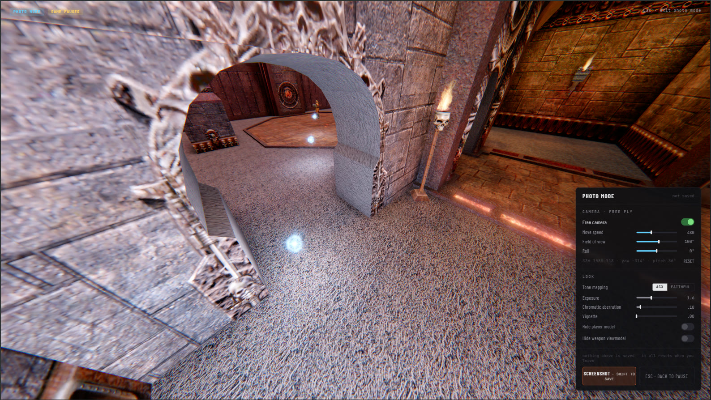

Pause anywhere and fly the camera. Move speed, field of view, roll, exposure, tone mapping,
vignette, chromatic aberration. Hide the player model or the gun. Then take the screenshot.

## Controls

All rebindable in Settings, two binds per action.

| | |
| --- | --- |
| **WASD** | move |
| **mouse** | turn · **left** fire · **right** jump |
| **space** | jump |
| **ctrl** | crouch |
| **2 3 4 5 7 8** | machine gun, shotgun, grenades, rockets, rail, plasma |
| **wheel** | cycle weapons |
| **B** or **Q** | reset view: level pitch, face along the course (whichever way is nearer) |
| **X** | kill yourself and restart the run |
| **R** | restart · **Esc** pause · **T** timeline (playback) · **F3** debug panel |

The weapon keys are Quake III's own numbers, gaps and all — 1, 6 and 9 are the gauntlet, the
lightning gun and the BFG, none of which exist here. Pick up a weapon you were not already
carrying and it is equipped for you; that is a switch in Settings if you would rather it was not.

Right-click jumps because rocket jumping needs fire and jump on the same hand, within a frame of
each other.

## VQ3 and CPM

**VQ3** is the default and matches Quake III exactly.

**CPM** gives you air control, ramp jumps and the 400ms double-jump window. It is reconstructed
from CPMA's own shipped game files rather than ported, because CPMA is closed source. On slick
floors it accelerates like DeFRaG's promode, so speedbelts such as flow's work.

## More

- [Every URL parameter](docs/url-parameters.md)
- [Developing Overbounce](docs/development.md)

## Licence

GPLv2-or-later. The movement and collision code derives from id Software's GPLv2 Quake III Arena
source. See `LICENSE` and `NOTICE`.

The three bundled DeFRaG courses are GPLv3. `NOTICE` explains what that means for redistribution
and what to drop for a v2-only build.

Assets come from [OpenArena](https://github.com/OpenArena). Assets from a commercial Quake III
Arena installation are **not** redistributable and must never be committed here.

Overbounce is not affiliated with or endorsed by id Software or Bethesda Softworks.
